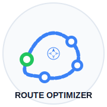

# Route Optimizer

<div align="center">
  
  
  <h3>Smart Trip Planning & Route Optimization</h3>
  <p>Powered by Dijkstra's Algorithm and WebAssembly</p>

  <div>
    
    
    
    
  </div>
</div>

## 🌟 Overview

Route Optimizer is an intelligent trip planning platform that helps you find the most efficient route between multiple destinations. Using advanced algorithms like Dijkstra's, enhanced with WebAssembly performance, it calculates the optimal path to visit all your locations while minimizing travel distance and time.

<div align="center">
  <svg width="800" height="400" viewBox="0 0 800 400" xmlns="http://www.w3.org/2000/svg">
    <!-- Main Background -->
    <rect width="800" height="400" fill="#f8fafc" rx="12"/>
    
    <!-- Map Section -->
    <rect x="400" y="50" width="350" height="300" fill="#e2e8f0" rx="8"/>
    
    <!-- Map Routes and Cities -->
    <path d="M500,150 C550,120 600,200 650,180 C700,160 720,250 650,280 C580,310 520,260 500,150Z" fill="none" stroke="#3b82f6" stroke-width="3" stroke-dasharray="6,3"/>
    
    <!-- Map Markers -->
    <circle cx="500" cy="150" r="10" fill="#22c55e"/>
    <circle cx="650" cy="180" r="10" fill="#3b82f6"/>
    <circle cx="650" cy="280" r="10" fill="#3b82f6"/>
    <circle cx="550" cy="230" r="10" fill="#3b82f6"/>
    
    <!-- Distance Labels -->
    <rect x="570" y="150" width="50" height="20" rx="4" fill="#ffffff" opacity="0.9"/>
    <text x="595" y="164" text-anchor="middle" font-family="Arial" font-size="10" fill="#334155">78 km</text>
    
    <rect x="650" y="230" width="50" height="20" rx="4" fill="#ffffff" opacity="0.9"/>
    <text x="675" y="244" text-anchor="middle" font-family="Arial" font-size="10" fill="#334155">92 km</text>
    
    <!-- Control Panel -->
    <rect x="680" y="60" width="60" height="30" rx="4" fill="#ffffff" opacity="0.9"/>
    <text x="695" y="80" text-anchor="middle" font-family="Arial" font-size="12" fill="#3b82f6">🔄 ⚙️ 📊</text>
    
    <!-- Sidebar -->
    <rect x="50" y="50" width="300" height="300" fill="#ffffff" rx="8" stroke="#e2e8f0" stroke-width="2"/>
    
    <!-- Sidebar Header -->
    <rect x="50" y="50" width="300" height="50" fill="#f1f5f9" rx="8 8 0 0"/>
    <text x="120" y="82" font-family="Arial" font-weight="bold" font-size="16" fill="#0f172a">Trip Planner</text>
    <circle cx="85" cy="75" r="12" fill="#3b82f6"/>
    <path d="M80,75 L85,70 L90,75 L85,80 Z" fill="#ffffff"/>
    
    <!-- Location List -->
    <rect x="70" y="120" width="260" height="40" rx="6" fill="#f1f5f9"/>
    <circle cx="90" cy="140" r="10" fill="#22c55e"/>
    <text x="90" y="144" text-anchor="middle" font-family="Arial" font-size="12" fill="#ffffff">1</text>
    <text x="180" y="135" font-family="Arial" font-size="12" fill="#0f172a">Mumbai</text>
    <text x="180" y="150" font-family="Arial" font-size="10" fill="#64748b">Starting Point</text>
    
    <rect x="70" y="170" width="260" height="40" rx="6" fill="#f1f5f9"/>
    <circle cx="90" cy="190" r="10" fill="#3b82f6"/>
    <text x="90" y="194" text-anchor="middle" font-family="Arial" font-size="12" fill="#ffffff">2</text>
    <text x="180" y="185" font-family="Arial" font-size="12" fill="#0f172a">Pune</text>
    <text x="180" y="200" font-family="Arial" font-size="10" fill="#64748b">Historical Sites</text>
    
    <rect x="70" y="220" width="260" height="40" rx="6" fill="#f1f5f9"/>
    <circle cx="90" cy="240" r="10" fill="#3b82f6"/>
    <text x="90" y="244" text-anchor="middle" font-family="Arial" font-size="12" fill="#ffffff">3</text>
    <text x="180" y="235" font-family="Arial" font-size="12" fill="#0f172a">Lonavala</text>
    <text x="180" y="250" font-family="Arial" font-size="10" fill="#64748b">Hill Station</text>
    
    <!-- Analytics Popup -->
    <rect x="450" y="70" width="150" height="85" rx="6" fill="#ffffff" stroke="#e2e8f0" stroke-width="1.5"/>
    <text x="525" y="95" text-anchor="middle" font-family="Arial" font-size="14" font-weight="bold" fill="#0f172a">Route Analysis</text>
    <text x="460" y="120" font-family="Arial" font-size="11" fill="#64748b">Total Distance: 285 km</text>
    <text x="460" y="140" font-family="Arial" font-size="11" fill="#64748b">Est. Time: 3.5 hours</text>
    
    <!-- Features Icons -->
    <circle cx="110" cy="330" r="20" fill="#f0f9ff"/>
    <path d="M105,330 L110,325 L115,330 L110,335 Z" fill="#3b82f6"/>
    
    <circle cx="170" cy="330" r="20" fill="#f0f9ff"/>
    <path d="M165,330 A5,5 0 0 1 175,330 A5,5 0 0 1 165,330" stroke="#3b82f6" stroke-width="2" fill="none"/>
    
    <circle cx="230" cy="330" r="20" fill="#f0f9ff"/>
    <rect x="225" y="325" width="10" height="10" fill="#3b82f6"/>
    
    <circle cx="290" cy="330" r="20" fill="#f0f9ff"/>
    <line x1="285" y1="325" x2="295" y2="325" stroke="#3b82f6" stroke-width="2"/>
    <line x1="285" y1="330" x2="295" y2="330" stroke="#3b82f6" stroke-width="2"/>
    <line x1="285" y1="335" x2="295" y2="335" stroke="#3b82f6" stroke-width="2"/>
    
    <!-- Button -->
    <rect x="100" y="275" width="200" height="35" rx="6" fill="#3b82f6"/>
    <text x="200" y="298" text-anchor="middle" font-family="Arial" font-size="14" fill="#ffffff">Find Best Route</text>
    
    <!-- Feature Labels -->
    <text x="400" y="380" text-anchor="middle" font-family="Arial" font-size="16" font-weight="bold" fill="#0f172a">Optimized Route Planning Made Simple</text>
  </svg>
</div>

## ✨ Key Features

### Smart Trip Planner

- **Location Search**: Easily search for and add multiple destinations
- **Route Optimization**: Find the most efficient path between all locations
- **Interactive Map**: Visualize your optimized route with clear directions
- **Time & Distance Analysis**: Get detailed insights about travel times and distances

### Dijkstra's Algorithm Visualizer

- **Build Custom Graphs**: Create networks with nodes and weighted edges
- **Step-by-Step Visualization**: Watch how the algorithm discovers the optimal path
- **Educational Tool**: Understand the inner workings of path-finding algorithms

### Technical Highlights

- **WebAssembly Integration**: High-performance route calculations
- **Responsive Design**: Works seamlessly on desktop and mobile devices
- **Real-time Updates**: Instant feedback as you modify your route
- **Shareable Routes**: Save and share your optimized journeys

## 🚀 Getting Started

### Prerequisites

- Node.js (v14 or higher)
- npm or yarn

### Installation

1. Clone the repository

```bash
git clone https://github.com/mihirphalke1/route-optimiser.git
cd route-optimiser
```

2. Install dependencies

```bash
npm install
# or
yarn install
```

3. Start the development server

```bash
npm run dev
# or
yarn dev
```

4. Open your browser and navigate to `http://localhost:3000`

## 🔧 Technologies Used

- **React**: UI framework for building interactive interfaces
- **TypeScript**: Type-safe code for better development experience
- **Tailwind CSS**: Utility-first CSS framework for styling
- **WebAssembly**: High-performance code for route calculations
- **Leaflet**: Interactive mapping library
- **Radix UI**: Accessible component primitives
- **Lucide Icons**: Beautiful, consistent icon set

## 💼 Use Cases

- **Travel Planning**: Plan vacations and road trips efficiently
- **Delivery Optimization**: Streamline delivery routes for businesses
- **Educational Purposes**: Learn about graph algorithms and optimization
- **Event Planning**: Organize multi-destination events and tours

## 🌐 Live Demo

Try out the Route Optimizer right now at [https://route-optimiser.vercel.app](https://route-optimiser.vercel.app)

## 📱 Screenshots

<div align="center">
  <p>Coming soon</p>
</div>

## 📝 License

This project is licensed under the MIT License - see the LICENSE file for details.

## 🙏 Acknowledgements

- [OpenStreetMap](https://www.openstreetmap.org/) for map data
- [Leaflet](https://leafletjs.com/) for the interactive mapping library
- [shadcn/ui](https://ui.shadcn.com/) for beautiful UI components
- All the open-source contributors who make projects like this possible

---

<div align="center">
  <p>Made with ❤️ by <a href="https://github.com/mihirphalke1">Mihir Phalke</a></p>
</div>
